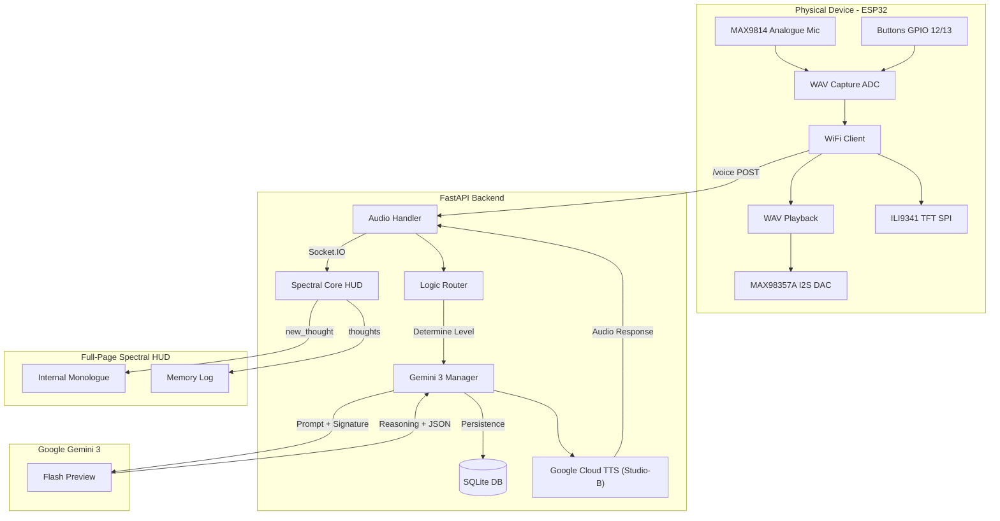

# 🗜️ Project Silas: Ghost in the Machine

> **"Fix your wiring before you talk to me."** — Silas

A physical AI agent powered by **Gemini 3 Flash**, designed to bridge the gap between "Stateless Chatbots" and "Reasoning Hardware Engineers." Silas doesn't just respond; he simulates your circuit logic using Gemini 3's native **High Thinking** capabilities.

[](https://opensource.org/licenses/MIT)
[](https://deepmind.google/technologies/gemini/)

---

## 🎙️ The Persona: Silas
Silas is a grumpy, veteran senior hardware engineer from the UK. He's cynical, blunt, and thinks your wiring is probably a fire hazard. However, he's deeply competent and will help you solve complex hardware bugs—while complaining about it the whole time.

## 📁 Repository Structure
```
ESP32-Gemini3-Agent/
├── backend/           # FastAPI server, Logic Router, and Database
├── firmware/          # PlatformIO ESP32 project
├── wokwi/             # Wokwi simulation files (sketch, diagram)
├── dashboard/         # Web-based "Glass Box" interface
├── prompts/           # Silas's system instructions
├── docs/              # Detailed hardware/behavior documentation
├── tools/             # Utility scripts (e.g., local TTS client)
└── README.md
```

---

## 🏗️ System Architecture



---

## 💻 Software Setup

### Backend (Python)
1. Install dependencies:
   ```bash
   pip install -r requirements.txt
   ```
2. Set your credentials in `.env.local`:
   ```bash
   GEMINI_API_KEY="your_api_key_here"
   GOOGLE_APPLICATION_CREDENTIALS="/path/to/project-silas-key.json"
   SILAS_VOICE="en-GB-Studio-B"
   ```
3. Run the server (from root):
   ```bash
   python -m backend.server
   ```
4. **Expose with localtunnel (Required for Wokwi)**:
   In a new terminal, run:
   ```bash
   npx localtunnel --port 8000 --subdomain silas-agent-v1
   ```

### Firmware (C++)
1. Open the **`firmware/`** folder in **PlatformIO**.
2. Configure `WiFi` and `serverUrl` in `src/main.cpp`.
3. Build and upload to your ESP32.

### 🧪 Simulating in Wokwi (Zero Hardware Required)
1. Open the [Wokwi project](https://wokwi.com/projects/455303685950683137).
2. Open the **Serial Monitor** in Wokwi.
3. Type your message (e.g., *"Why is my I2C buffer overflowing?"*) and press **Enter**.
4. Silas will process your text, respond on the TFT, and speak through your speakers via the server-side TTS.

---
[!IMPORTANT]
**Disclaimer**: This project utilizes Gemini 3 Flash’s native thinking capabilities. Silas's 'Internal Monologue' is not a pre-written script; it is a real-time summary of the model's logical steps.

## 👥 Credits & Acknowledgments
* **Lead Developer**: Nadine van der Haar
* **Core Intelligence**: Powered by **Google Gemini 3 Flash**
* **Code Orchestration**: Developed with **Antigravity**
* **Voice Synthesis**: **Google Cloud Text-to-Speech** (Studio-grade)

---
*Built for the 2026 Gemini 3 Hackathon*